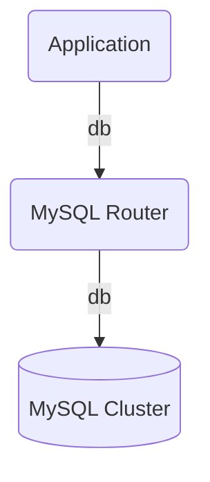

# mysql-router-operators
[](https://charmhub.io/mysql-router-k8s)
[](https://charmhub.io/mysql-router)
[](https://github.com/canonical/mysql-router-operators/actions/workflows/release.yaml)
[](https://github.com/canonical/mysql-router-operators/actions/workflows/ci.yaml)
-----------------
## Description

The Charmed MySQL Router Operator is a database proxy for [Group Replicated
MySQL](https://dev.mysql.com/doc/refman/8.0/en/mysql-innodb-cluster-introduction.html)
clusters.

MySQL Router is a middleware that provides transparent routing of MySQL servers
and client applications. More info at [MySQL
Router](https://dev.mysql.com/doc/mysql-router/8.0/en/).

The proxy sits between the MySQL cluster and a client application, e.g.:



## Usage

This charm must be used coupled with mysql charm, through a relation, e.g.:

### Kubernetes
```bash
juju deploy mysql-k8s --trust
juju deploy mysql-router-k8s --trust
juju integrate mysql-k8s mysql-router-k8s
```

### Machines
```bash
juju deploy mysql
juju deploy mysql-router
juju integrate mysql mysql-router
```

## Relations

Relations are defined in `metadata.yaml` are:

* Requires: db
* Provides: db

## Contributing

Please see the [Juju SDK docs](https://juju.is/docs/sdk) for guidelines on
enhancements to this charm following best practice guidelines, and
[CONTRIBUTING.md](./CONTRIBUTING.md)
for developer guidance.
